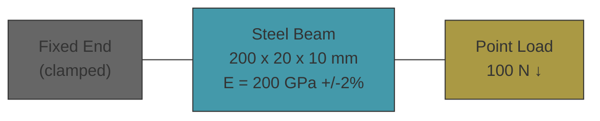

# mechanical-base


Cantilever beam sizing — verifies tip deflection and maximum bending stress for a rectangular steel support beam under a point load at the free end.

An engineer preparing a submittal package for an EPC contractor needs to confirm that a proposed member meets deflection and stress limits before fabrication. The Euler-Bernoulli closed-form solution (delta = PL³/3EI, sigma = PLc/I) provides exact expected values. The CalculiX FEM simulation solves the same problem numerically on a 3D mesh. Agreement between them validates the model and toolchain.

## Beam Spec



## Workflow

```
theory.ipynb (sympy derivation + expected values) -> cad/ (CadQuery STEP) -> sim/ (gmsh mesh -> CalculiX FEM) -> pytest (assert FEM matches theory)
```

1. `theory.ipynb` derives deflection and stress symbolically, plugs in actual parameters with pint + uncertainties to produce expected values
2. `cad/model.py` generates the parametric beam geometry via CadQuery, exports STEP
3. `sim/mesh.py` meshes the STEP with gmsh (C3D4 linear tets)
4. `sim/solve.py` writes the CalculiX input deck (BCs, material, loading), runs ccx
5. `sim/test_run.py` asserts FEM deflection and stress match analytical values within tolerance

## Quick Start

```bash
uv sync
uv run poe model        # CadQuery -> STEP
uv run poe mesh          # gmsh -> mesh INP
uv run poe checks        # format + lint
uv run poe notebook      # execute theory.ipynb
uv run poe sim           # pytest
```

## Structure

- `theory.ipynb` — sympy derivation, pint + uncertainties, expected values
- `sim/constants.py` — physical parameters with units, tolerances, and sources
- `sim/mesh.py` — gmsh meshing of STEP geometry
- `sim/inp_writer.py` — assembles CalculiX input deck from mesh + BCs + material
- `sim/solve.py` — runs CalculiX, parses results
- `sim/frd_parser.py` — reads CalculiX .frd output for displacement + stress
- `sim/test_run.py` — pytest assertions: tip deflection (5%), bending stress (10%)
- `cad/model.py` — CadQuery parametric beam geometry
- `spec/` — output artifacts (drawings, PDFs)
