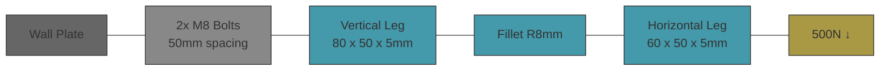

# mechanical-model


L-bracket bolted connection — verifies bolt reaction forces and bracket stress for a steel L-bracket bolted to a wall plate under a vertical point load.

An engineer sizing a mounting bracket needs to confirm that the bolts and bracket meet strength requirements before fabrication. The bolt group hand calculation provides expected reaction forces (rigid bracket assumption). The CalculiX FEM simulation solves the same problem numerically on a 3D mesh. Agreement validates the model and toolchain; the bracket stress must remain below yield.

## Bracket Spec



Material: ASTM A36 steel (E = 200 GPa, σ_y = 250 MPa)

## Workflow

```
theory.ipynb (sympy + pint) -> cad/model.py (CadQuery -> STEP) -> sim/model.py (pygccx -> CalculiX FEM) -> pytest (assert FEM matches theory)
```

1. `theory.ipynb` derives bolt group forces symbolically, plugs in parameters with pint
2. `cad/model.py` generates the parametric L-bracket via CadQuery, exports STEP
3. `sim/model.py` meshes STEP with gmsh, builds CalculiX model via pygccx, solves, extracts results
4. `sim/test_run.py` asserts FEM bolt force matches hand calc within 25%, stress below yield

## Quick Start

```bash
uv sync
uv run poe checks          # ruff format + lint
uv run poe notebook         # execute theory.ipynb
uv run poe build            # CadQuery -> STEP
uv run poe sim              # pygccx + pytest (2/2 tests)
uv run poe validate-model   # BRep validity + bbox vs constants
uv run poe inspect-model    # open bracket in FreeCAD
uv run poe inspect-asm      # open assembly in FreeCAD
uv run poe drawings         # CadQuery SVG drawings -> spec/drawings/
```

## Structure

- `theory.ipynb` — sympy bolt group derivation, pint + uncertainties, expected values
- `sim/constants.py` — bracket/bolt dimensions, material, load, derived bolt group values
- `sim/model.py` — pygccx: mesh + CalculiX solve + result extraction
- `sim/test_run.py` — pytest: bolt force (25%), stress below yield
- `cad/model.py` — CadQuery parametric L-bracket geometry
- `cad/assembly.py` — CadQuery Assembly: bracket + wall plate + bolts
- `cad/drawing.py` — CadQuery SVG projections (front, side, iso)
- `spec/drawings/` — exported SVG drawings
