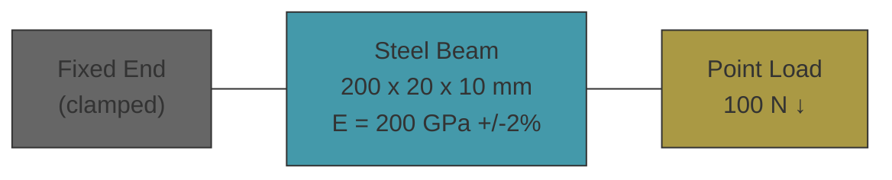

# mechanical-base


Cantilever beam sizing — verifies tip deflection and maximum bending stress for a rectangular steel support beam under a point load at the free end.

An engineer preparing a submittal package for an EPC contractor needs to confirm that a proposed member meets deflection and stress limits before fabrication. The Euler-Bernoulli closed-form solution (delta = PL³/3EI, sigma = PLc/I) provides exact expected values. The CalculiX FEM simulation solves the same problem numerically on a 3D mesh. Agreement between them validates the model and toolchain.

## Beam Spec



## Workflow

```
theory.ipynb (sympy + pint) -> cad/model.py (CadQuery -> STEP) -> sim/model.py (pygccx -> CalculiX FEM) -> pytest (assert FEM matches theory)
```

1. `theory.ipynb` derives deflection and stress symbolically, plugs in actual parameters with pint + uncertainties
2. `cad/model.py` generates the parametric beam geometry via CadQuery, exports STEP
3. `sim/model.py` meshes STEP with gmsh, builds CalculiX model via pygccx, solves, extracts results
4. `sim/test_run.py` asserts FEM deflection and stress match analytical values within tolerance

## Quick Start

```bash
uv sync
uv run poe checks       # ruff format + lint
uv run poe notebook      # execute theory.ipynb
uv run poe build         # CadQuery -> STEP
uv run poe sim           # pygccx + pytest
uv run poe inspect       # open STEP in FreeCAD
uv run poe export        # CadQuery SVG drawings -> spec/drawings/
```

## Structure

- `theory.ipynb` — sympy derivation, pint + uncertainties, expected values
- `sim/constants.py` — physical parameters with units, tolerances, and sources
- `sim/model.py` — pygccx: mesh + CalculiX solve + result extraction
- `sim/test_run.py` — pytest assertions: tip deflection (5%), bending stress (10%)
- `cad/model.py` — CadQuery parametric beam geometry
- `cad/drawing.py` — CadQuery SVG projections (front, side, iso)
- `spec/drawings/` — exported SVG/PDF drawings
